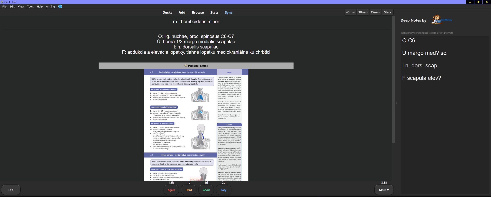

# Deep Notes by AnkiMonkey

  

> A simple scratchpad panel that appears while you review cards.

---

## What it does

- Opens a writing panel on the right side of the reviewer
- Lets you write down thoughts, hypotheses, or working memory while answering
- Automatically clears after you rate the card — keeping your workspace fresh for the next one

---

## Why it's useful

- Encourages active recall — write before flipping the answer
- Great for medical and science learning
- Keeps temporary thinking separate from permanent notes
- Fully local, no cloud, no sync

---

## How to use

1. Install the add-on
2. Start reviewing cards
3. Panel appears automatically
4. Write while solving
5. Rate card → panel clears

---

## Compatibility

- Anki 23.x+
- PyQt6

---

## Screenshots

  

---

Made with ☕ by AnkiMonkey
