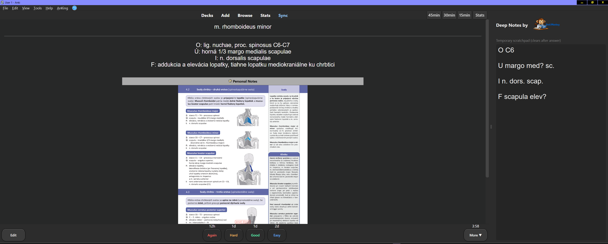

  
  

A simple notepad where you can write ideas how you would answer that appears while you review cards.

---

## What it does

- Opens a writing panel on the right side of the reviewer
- Lets you write down thoughts, hypotheses, or working memory while answering
- Automatically clears after you rate the card — keeping your workspace fresh for the next one

---

## Why it's useful

- Encourages active recall — write before flipping the answer
- Great for medical and science learning
- Keeps temporary thinking separate from permanent notes
- Fully local, no cloud, no sync

---

## How to use

1. Install the add-on
2. Start reviewing cards
3. Panel appears automatically
4. Write while solving
5. Rate card → panel clears

---

## Options (v2)

- **Adjustable width** – Narrower / Wider buttons or `Alt+,` / `Alt+.`, minimum width in settings (was fixed 400 px); width is remembered
- **Collapse** to a thin strip – `»` button or `Alt+N`
- **Table mode** – `Alt+M`: column *Base* (template or numbers 1–10), column *Notes* you fill in while solving the card
- **Keyboard-safe** – typing in the panel never flips the card; Enter = next row, Tab = next cell, Esc = back to the card, `Alt+P` = jump into the panel
- **TXT templates** – loaded per card by tag rule → tag → deck → `default.txt` from `user_files/templates`, or manually via *Load TXT* / `Alt+I`
- **Save template** – `Alt+W` saves the Base column (or the text) as the template for this card (old file kept as `.bak`)
- **Tag rules** – e.g. tag `Bones` (and every `Bones::…` subtag) → `bones_notes.txt`, first matching rule wins
- **Settings window** – ⚙ Settings, `Alt+S` or Tools → Add-ons → Config, every option with a short explanation
- After answering: table keeps the Base column and clears Notes; text is cleared (a template is loaded again)
- Hidden outside review, small optional logo, everything in `config.json` (see `config.md`)

## Compatibility

- Anki 23.x+
- PyQt6

---

## Screenshots

  

---

Made with ☕ by AnkiMonkey
